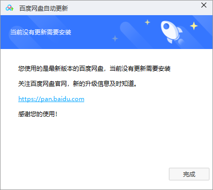
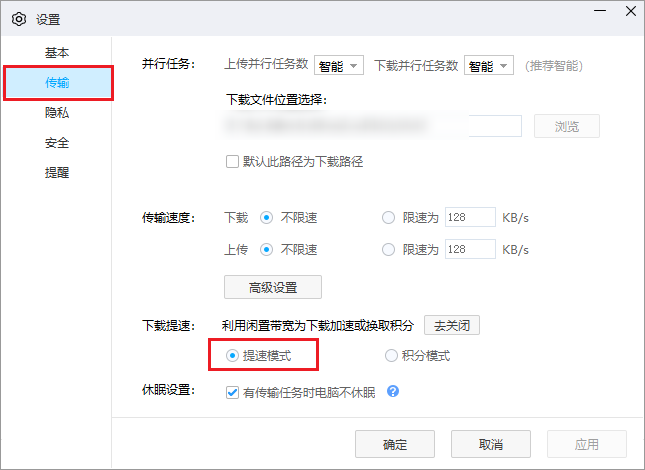

# 开学(课)前准备

- 此[README文档](README.md)将引导各位同学完成开学(课)前的基本准备，包括[专业认知](#专业认知)、[软件安装](#软件安装)、[参考资料](#参考资料)、[注意事项](#注意事项)。希望各位同学<u>***严格按照指引进行操作，并优先阅读注意事项。***</u>

## 专业认知

- [维基百科](https://zh.wikipedia.org/wiki/通信工程)

  > **通信工程**（也作**信息工程**、**电信工程**，旧称**远距离通信工程**、**弱电工程**）是一门以[电气](https://zh.wikipedia.org/wiki/電機工程學)和[计算机工程](https://zh.wikipedia.org/wiki/計算機工程)为中心的[工程](https://zh.wikipedia.org/wiki/工程学)学科，其关注的是通信过程中的信息传输和信号处理的原理和应用，旨在支持和加强[电信](https://zh.wikipedia.org/wiki/电信)系统。[[1]](https://zh.wikipedia.org/wiki/通信工程#cite_note-1)[[2]](https://zh.wikipedia.org/wiki/通信工程#cite_note-2) 通信工程的基础建立于[应用数学](https://zh.wikipedia.org/wiki/应用数学)中的[数理方程](https://zh.wikipedia.org/w/index.php?title=数理方程&action=edit&redlink=1)。其理论起点是物质与波在[傅里叶](https://zh.wikipedia.org/wiki/傅里叶变换)[热扩散](https://zh.wikipedia.org/w/index.php?title=热扩散&action=edit&redlink=1)和[麦克斯韦电动力](https://zh.wikipedia.org/wiki/麦克斯韦方程组)条件下观察到的传播现象。
  >
  > 通信工程研究的是，以[电磁波](https://zh.wikipedia.org/wiki/电磁学)、[声波](https://zh.wikipedia.org/wiki/声波)或[光波](https://zh.wikipedia.org/wiki/光波)的形式把[信息](https://zh.wikipedia.org/wiki/信息)通过电脉冲，从发送端（[信源](https://zh.wikipedia.org/wiki/信源)）传输到一个或多个接受（[信宿](https://zh.wikipedia.org/w/index.php?title=信宿&action=edit&redlink=1)）。接受端能否正确辨认信息，取决于传输中的损耗高低。[信号处理](https://zh.wikipedia.org/wiki/信号处理)是通信工程中一个重要环节，其包括[过滤](https://zh.wikipedia.org/wiki/过滤)，[编码](https://zh.wikipedia.org/wiki/编码)和[解码](https://zh.wikipedia.org/wiki/解碼)等。工作范围从基本的[电路设计](https://zh.wikipedia.org/wiki/电路设计)到战略性质的大规模设备研究与部署。
  >
  > 通信工程所关注的频段涉及甚广。低频段，亦即低[赫兹](https://zh.wikipedia.org/wiki/赫兹)，关心的是[技术声学](https://zh.wikipedia.org/w/index.php?title=技术声学&action=edit&redlink=1)或[低频技术](https://zh.wikipedia.org/w/index.php?title=低频技术&action=edit&redlink=1)。高频段中关注的范围从[微波](https://zh.wikipedia.org/wiki/微波)或[雷达](https://zh.wikipedia.org/wiki/雷达)系统到[可见光](https://zh.wikipedia.org/wiki/可见光)的[激光](https://zh.wikipedia.org/wiki/激光)或[镭射](https://zh.wikipedia.org/wiki/镭射)系统。微波到可见光中间的频段几乎都是通信工程的研究对象。除此之外，通信过程中所应用的媒介和技术，包括通信系统在陆上、水下、空中和宇宙空间中的应用，也是相当丰富的。
  >
  > 通信工程是与[电子](https://zh.wikipedia.org/wiki/电子工程)，[土木](https://zh.wikipedia.org/wiki/土木工程)和[系统工程](https://zh.wikipedia.org/wiki/系统工程)等多学科相关的工程领域。这些学科为通信工程前期基础设施设备地建设提供帮助。 最终，由电信工程师负责提供高速[数据传输](https://zh.wikipedia.org/wiki/数据传输)服务。 他们使用各种设备和传输介质来设计电信网络基础架构；当今，有线电信使用的最常见的介质是[双绞线](https://zh.wikipedia.org/wiki/双绞线)、[同轴电缆](https://zh.wikipedia.org/wiki/同轴电缆)和[光纤](https://zh.wikipedia.org/wiki/光導纖維)。 电信工程师还提供围绕[无线](https://zh.wikipedia.org/wiki/無線通訊)通信和信息传输模式的解决方案，例如无线电话服务，无线电和[卫星通信](https://zh.wikipedia.org/wiki/通訊衛星)以及[互联网](https://zh.wikipedia.org/wiki/互联网)和[宽带](https://zh.wikipedia.org/wiki/寬頻)技术。

  -----
  
- 什么是通信？北邮版《通信原理》教材的第一句话是——通信乃是互通信息。通信工程是一门软硬件结合的专业，但侧重点在硬件。大致可以分为前端与后端。前端主要为信号的接收、发射、信号预处理……后端主要为信号的处理。其中前端的理论知识更为复杂。通信工程专业所学习的知识在电子信息类属于万金油。学习的主要重点为(重点课程已**加粗**)：**高等数学**、模拟电子技术、数字电子技术、**信号与系统**、**数字信号处理**等。同时对于该专业的学习本科阶段较浅，主要还是展开知识面，因此喜欢研究的同学可以考虑考研继续深造，但本专业最看重的还是能力。就业方向：各大通信的科研院所:比如原信息产业部电信研究院、通信咨询和设计单位：如中讯设计院、京移设计院、广东电信设计院、浙江华信院、各大运营商（移动、电信、联通、各通信设备厂家（华为、中兴、烽火、大唐、爱立信、摩托、阿朗、诺西）。

## 软件安装

- 软件安装：[点击阅读](01_软件)

## 参考资料

- 参考资料：[点击阅读](02_资料)

## 注意事项

- **请先临时关闭电脑上的任何杀毒软件。**

- 软件下载地址如果有两个的，可以选择“下载地址1”下载，速度较快，“下载地址1”是我自己掏钱买的带宽，大家不要滥用，能保证全班同学下载。

- 关于软件及资料的下载，我们将采取多种方式，比如直链下载、网盘下载等。

- 下载的部分文件为压缩包(zip,rar,7z等)，需要使用解压软件，这里推荐一款：**Bandzip** 。  
  - [官网](https://www.bandisoft.com/bandizip/)  
  - [下载地址](https://dl.bandisoft.com/bandizip.online/BANDIZIP-SETUP-ONLINE.EXE)
- 正确的解压方式：
    **请完全将压缩包解压，切忌单独提取文件使用！**

    
- 在使用百度网盘(PC客户端)进行下载时，需要一些必要的操作，来的提高速度：
  - 确保你的百度网盘为最新版本。

  
  - 按照图片进行修改。选择提速模式。

    
    

[返回上一级](../README.md)
