**本页面含有图片。如果图片加载失败，请点击下方链接查看教程。**
**[>>>Gitee](https://gitee.com/benjiah/CDU20-CE)**

 1. 解压完成后首先运行MDK531.EXE，点击Next。

    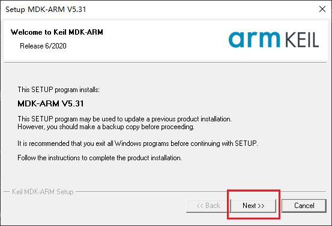

2. 同意协议并点击Next

    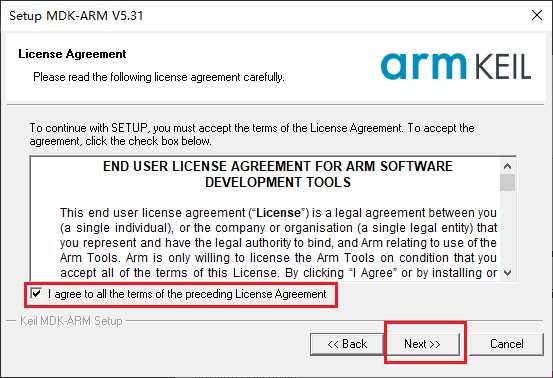

3. 选择Core和Pack的安装路径。一般来说Core安装在X:/Keil_v5，Pack安装在X:/Keil_v5/Arm/Packs，**其中X不能为系统盘（一般为C盘）注：安装路径中不能有中文**。然后点击Next。

    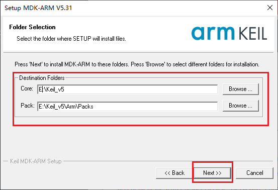

4. 个人信息四个选项中，**各输入一个空格即可**。然后点击Next。

    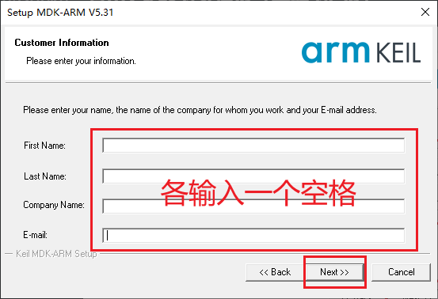

5. 开始安装，请耐心等待。

    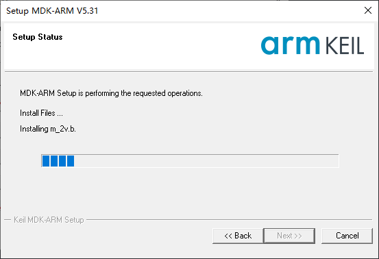
	
6. 取消勾选。点击Finish退出安装。

    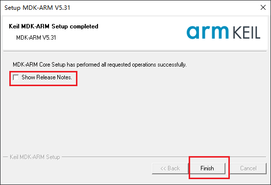
	
 7. 在新打开的窗口中点击OK。**然后关闭Pack Installer和Keil uVision® 5**

    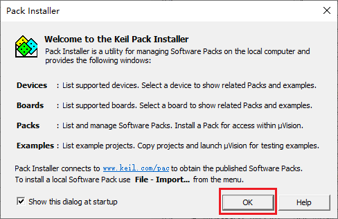

 8. **运行c51v960a.exe**，点击Next直到出现以下界面，选择安装路径。**请选择第3步中相同路径X:/Keil_v5。注：安装路径中不能有中文**（一般来说，系统会自动检测路径。）并点击Next。

    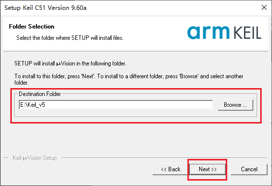

 9. 个人信息四个选项中，**各输入一个空格即可**。然后点击Next。

    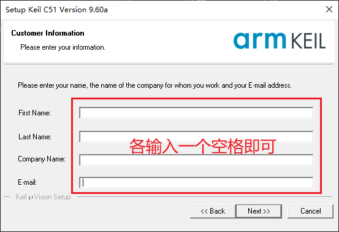

 10. 开始安装，请耐心等待。

     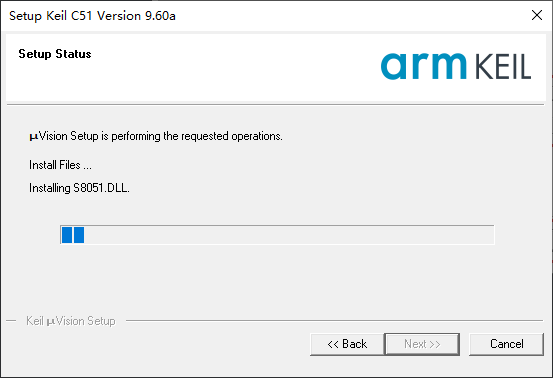

 11. 如果出现以下提示，选择Replace all即可。

     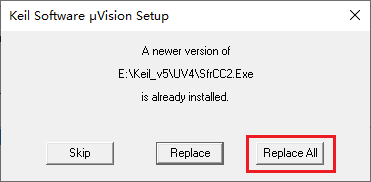

 12. 取消勾选。点击Finish退出安装。

     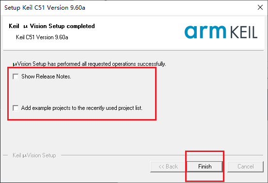

 13. 在桌面左下角中打开开始菜单，找到最近添加中的Keil uVision® 5，点击右键，**选择以管理员方式运行**。

     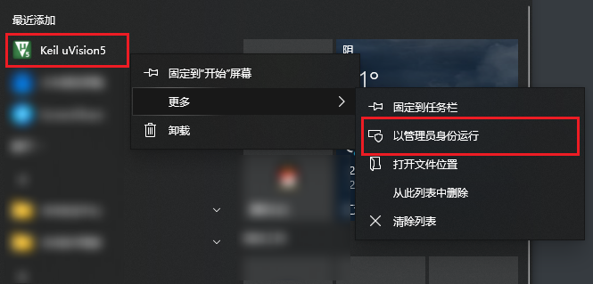

 14. 打开File -->License Management

     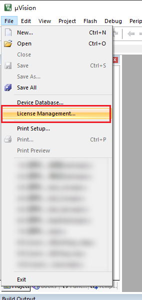

 15. 选中CID,右键复制。

     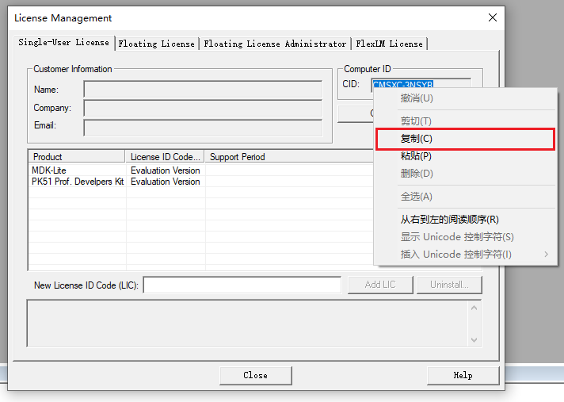
 16. **运行Keil Generic Keygen.exe**。

 17. **在CID中粘贴刚才复制的代码。选择Target为ARM，模式为Professional，点击Generate，选中并复制生成的代码。注意不要关闭Keil Generic Keygen.exe。** 如图所示。
     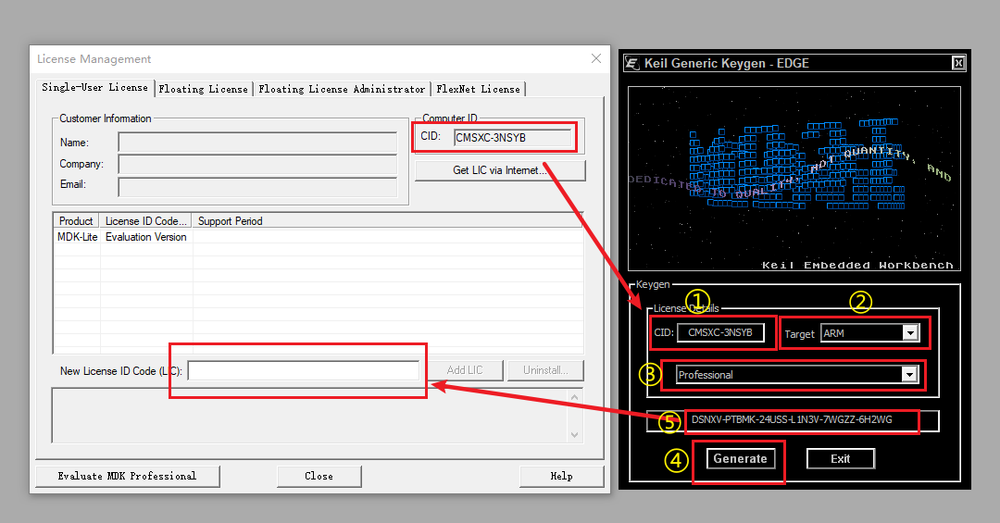

 18. 将代码粘贴到刚才打开的License Management的New License ID Code中。点击Add LIC。出现如图所示即为成功。

     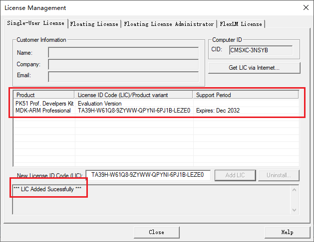

 19. 回到Keil Generic Keygen.exe。**更改Target为C51。再次点击Generate，选中并复制生成的代码。**

     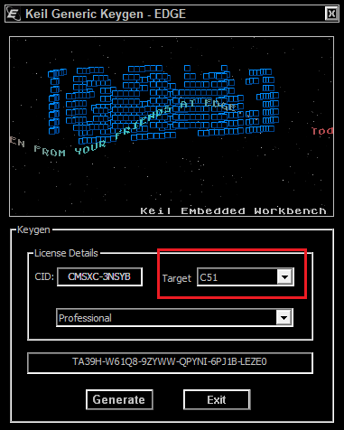

 20. 将代码粘贴到刚才打开的License Management的New License ID Code中。点击Add LIC。出现如图所示即为成功。

     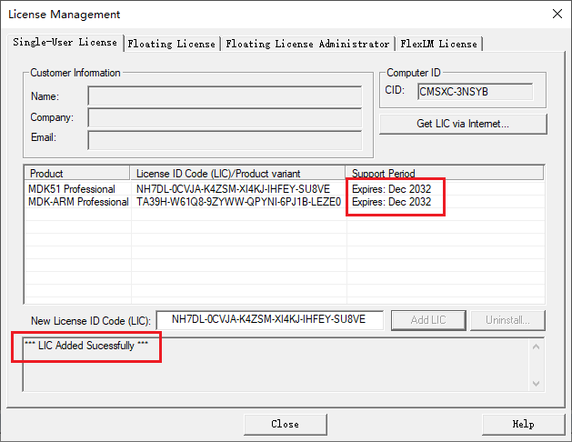

 21. 关闭Keil uVision5和Keil Generic Keygen.exe。

 22. 安装完成。

[返回上一级](README.md)
