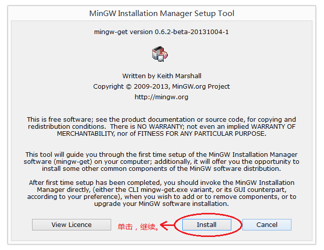
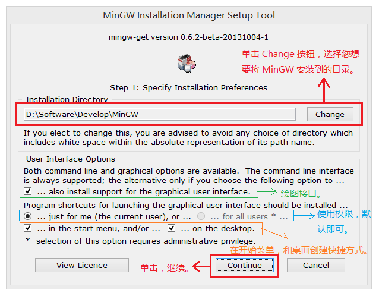
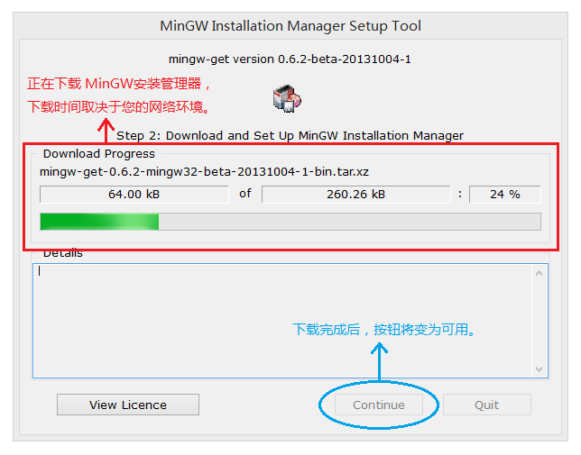
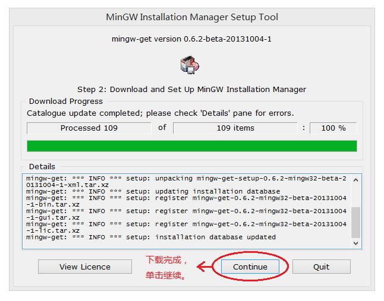
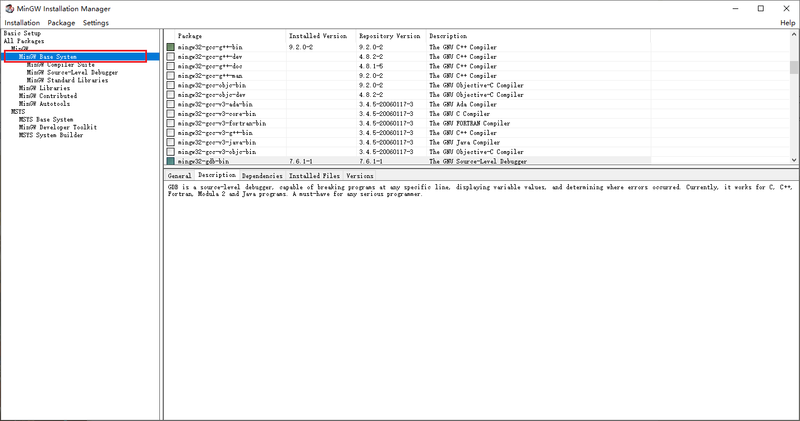
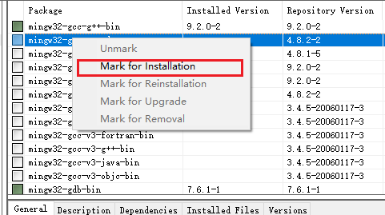
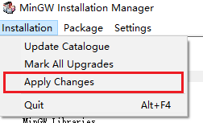
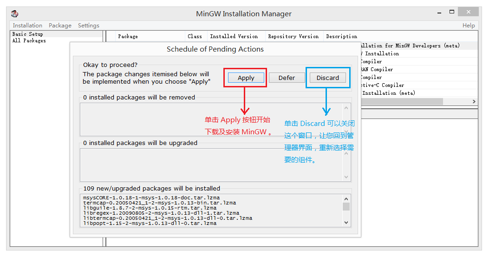
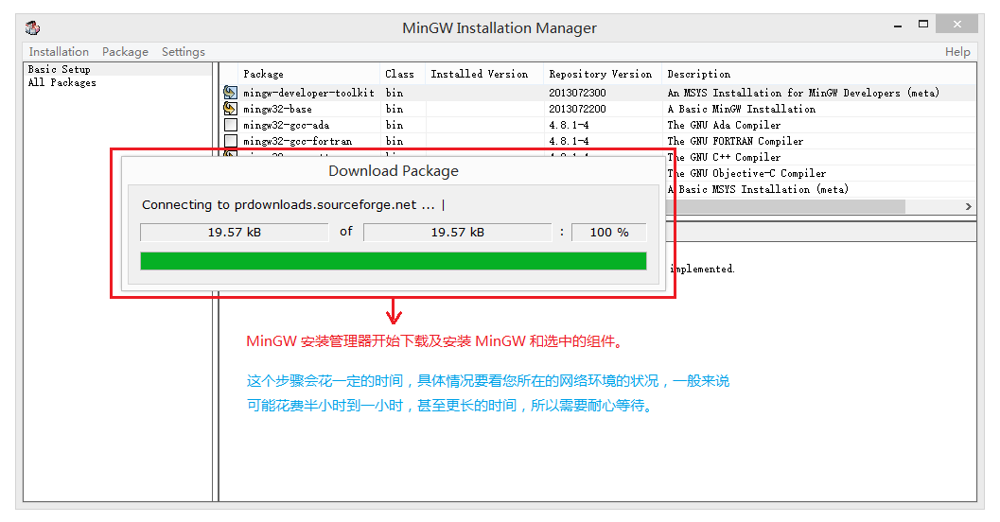

***本页面含有图片。如果图片加载失败，请点击下方链接查看教程。*** 
***[>>>Gitee](https://gitee.com/benjiah/CDU20-CE)***

1. MinGW安装管理器的安装程序——首页

	双击运行 MinGW 安装管理器的安装程序后，会首先显示这个页面，上面写了一些 MinGW 安装管理器的介绍，这里我们不用管它，直接单击 **Install** 按钮开始安装。

	

2. MinGW安装管理器的安装程序——安装选项页

	在这一步只需修改 MinGW 要安装在哪个目录，其他使用默认设置即可。**注：安装路径中不能有中文**

	注意：安装 MinGW 需要500MB左右的硬盘空间，确定您选择的目录所在的硬盘分区有足够的剩余空间。

	

3. MinGW安装管理器的安装程序——管理器开始下载安装

	现在安装程序已经正式开始下载并安装 MinGW安装管理器 了，在这个步骤里所花费的时间，决于您所在地区的网络环境的好坏，一般来说并不会花费太长时间，在数分钟范围内即可完成。

	

4. MinGW安装管理器的安装程序——管理器下载安装完成

	现在 MinGW 安装管理器已经安装完成，我们可以开始正式安装 MinGW 了。

	

5. 打开MinGW Installer，选择Mingw Base System。

	

6. 在右侧找到**mingw32-gcc-g++-bin**和**mingw32-gdb-bin**,分别右键选择Mark for installation。

	

7. 打开 Installation --> Apply changes

	

8. 弹出的这个是确认窗口，我们直接单击 **Apply** 按钮，之后安装管理器就会真正的开始下载安装 MinGW 了。

	

9. MinGW安装管理器——开始下载安装MinGW组件

	

10. 安装结束后即可退出MinGW安装管理器。

[返回上一级](README.md)