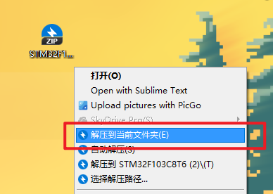
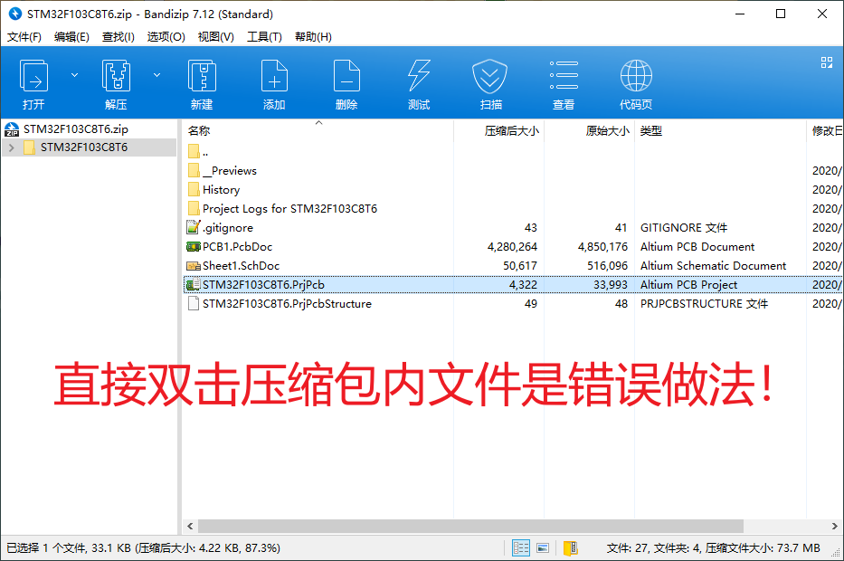
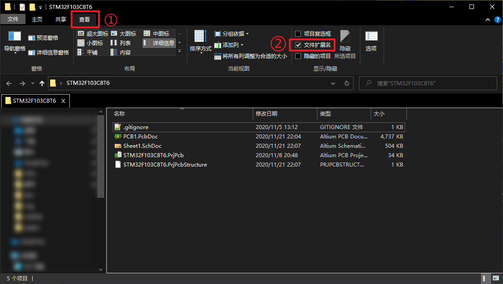

# 06_PCB_Design-Lesson5(PCB设计-第五课时)

- 2020/11/22

#### [>>>Prj(AD工程)](../02_PCB_Design-Lesson1/Prj)

#### 注意事项
正确的解压方式：

- 下载好压缩文件后，切忌直接打开。
- 正确的方式为右键压缩包文件，选择解压到当前文件夹。(如图)

正确的打开工程方式：
- 完成上一步解压后。打开解压后的文件夹，位置就在压缩包相同的文件夹内。
- 如图：①点击查看；②将“文件扩展名”打勾。
  - [X] 文件扩展名
  
  - 
- 完成后，可以看见文件名都变为了“*.xxx”
- 我们双击文件名后缀为“PrjPcb”的文件。“Prj”即为Project(工程)的缩写。
- 这样我们就打开了正确的工作文件。
- 切忌单独打开后缀为“PcbDoc”和“SchDoc”文件。
