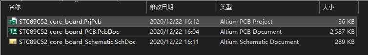
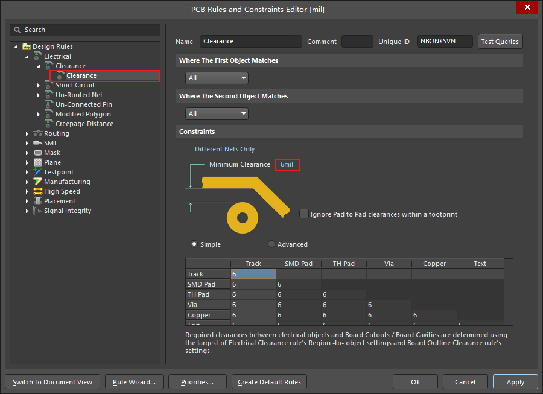
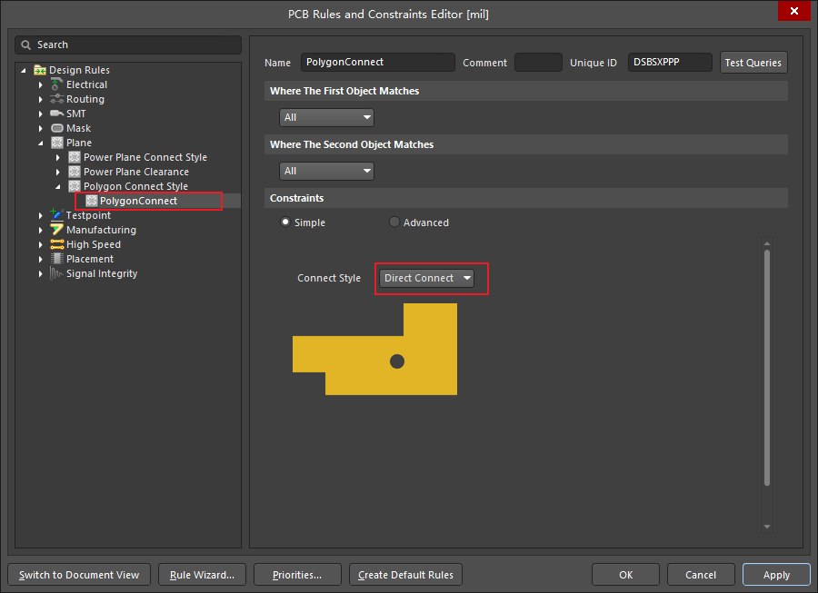

# 2020-2021第一学期学长课堂期末考核

- 通信工程20级3班
- 作品提交截止时间：2021年1月2日23:59。
- 请将您的完成的作品提交在[**这里**](https://wss.pet/s/4aau43tl75a)
  - 1.***访问密码：6126***；
  - 2.提交时称呼请填写”姓名_学号“，如”202010428301_张三“；
  - 3.请将考核提交作品放入文件夹并压缩成“ .zip”文件，文件夹与压缩文件均命名为“学号_姓名_题目编号”。例如：“202010428301_张三_1.zip”；
- 请在[**这里**](https://www.wjx.cn/jq/102355463.aspx)登记您的选题。
- 注意事项：
  - 1.下载[**资料**](#3考核资料)后请[**完全解压文件**](../../06_PCB_Design-Lesson5/README.md/####注意事项)；
  - 2.本次考核共有两个大题，任选其一即可；
  - 3.**本次考核将作为本学期学长课堂优秀学员以及进入科创室资格的重要参考指标**；
  - 4.严禁抄袭，若有雷同，严肃处理。

## 0.考核说明

- 考核方式：按照科创室统一安排本次考核方式为：**现场演示+答辩**；
- 考核时间：第16教学周周日（2021年1月3日）19：00-21：00；
- 考核内容：主要对题目中的原理、处理细节以及软件操作进行答辩。

## 1.PCB电路设计

### 1.1内容

- 按照原理图绘制原理图以及PCB。

### 1.2注意事项

- 1.原理图位于“[2020-2021-1_final_exam/PCB_Design/STC89C52_core_board/STC89C52_core_board_schematic.pdf](2020-2021-1_final_exam/PCB_Design/STC89C52_core_board/STC89C52_core_board_schematic.pdf)”；
- 2.集成库文件位于“[2020-2021-1_final_exam/PCB_Design/STC89C52_core_board/STC89C52_core_board.IntLib](2020-2021-1_final_exam/PCB_Design/STC89C52_core_board/STC89C52_core_board.IntLib)”；
- 3.请安装本次考核提供的PCB专用库(STC89C52_core_board.IntLib)，否则3D封装会出错，若使用本次考核以外封装库，成绩作废。原理图的绘制一定要和PDF文档一致，不得自行更改；
- 4.提交说明：提交的文件夹中需要包含三个文件，并且三个文件的命名均为“STC89C52_core_board”，如下图。其余文件均需要删除后提交：

- 5.以下几点为具体设计要求：
  - 1.元件布局合理、美观，使整个设计人性化；
  - 2.信号线拐角没有小于等于90 度的弧角；信号线线宽为10-15mil；飞线尽量少；
  - 3.电源线的粗细根据所连接芯片的功耗、类型而决定，线宽可从10mil、20mil、30mil、40mil、50mil 中选择；
  - 4.对焊盘加有“滴泪(Teardrops)”，PCB 图的“工具”中选择“滴泪”；信号线的过孔内径(Hole Size)设为8mil，外径(Diameter)设为15mil；电源线的过孔大小由电源线的粗细决定，Hole Size 比线宽小2mil，Diameter 比线宽大5mil；丝印层调整参数Text Height为0.8mm，Stroke Width为0.15mm。
- 6.工程的设计规则设置（从Altium Designer的主菜单中执行菜单命令”Design（设计）“->”Rules（规则）“），具体设置如下图所示，设置完成后点击“Apply（应用）”，再点击“OK(确定)”。
  - 1.Clearance(安全距离)选项区域里设置安全距离为6mil；

  - 2.Plane(版图平面)区域的Polygon Connect设置为Direct Connect 。

## 2.C语言程序设计

### 2.1内容

- 利用现学C语言知识编写一个简单的计算器。要求有如下功能:
  - 1.整数及浮点数的加、减、乘、除（含余数）；
  - 2.可以实现十进制与二进制的转换；十六进制与二进制的相互转换；
  - 3.两个整数的求模运算；
  - 4.输入两个正整数，求其GCD和LCM。

### 2.2注意事项

- 1.提交说明：只需提交源代码(C Source file)文件。提交的源代码文件命名为“Calculator.c“；
- 2.此程序需要与用户进行交互（如：提示用户选择功能、输入数字等）；
- 3.代码格式尽量规范。

## 3.考核资料

- 下载地址：[**2020-2021-1_final_exam.zip**](https://cs-ans.chaoxing.com/download/497b0131ff6e6e7632988648e4363613)
- SHA1：a900b038f6e0d2d6c71d2a12d272611699fb9e5f
