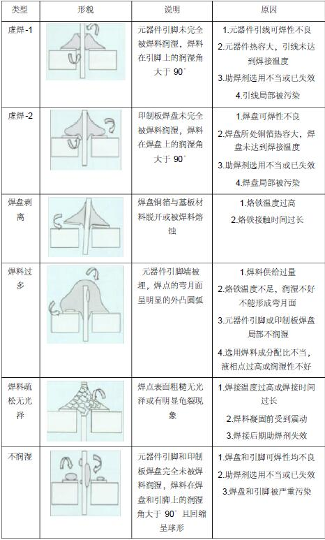

# 焊接步骤
## （1） 预热
将烙铁头与元件引脚、 焊盘接触，同时预热焊盘与元件引脚， 而不是仅仅预热元件。
##（2）加焊锡
焊锡加焊盘上（而不是仅仅加在元件引脚上） ，待焊盘温度上升到使焊锡丝熔化的温度，焊锡就自动熔化。不能将焊锡直接加在烙铁头上使其熔化，这样会造成冷焊。
## （3）撤离焊锡
加适量的焊锡，然后拿开焊锡丝。
## （4）停止加热
拿开焊锡丝后，不要立即拿走烙铁，继续加热使焊锡完成润湿和扩散两个过程，直到焊点最明亮时再拿开烙铁。
## （5）冷却
在冷却过程中不要移动PCB板。
### 注意：掌握焊接要领是获得良好焊点的关键，一般焊接要领有以下几点。
##（1）接触位置：烙铁头应同时接触需要互相连接的 2 个被焊件（如引线和焊盘），烙铁一般倾斜 45°，应避免只与其中一个被焊件接触。当两个被焊件热容量悬殊时，
应适当调整烙铁倾角，使热容量较大的被焊件与烙铁头得接触面积增大，热传导得到加强。两个被焊件能在相同的时间内被加热到相同的温度，被视为加热理想状态。
##（2）接触压力：
烙铁头与被焊件接触时应略施压力，热传导强弱与施加压力大小成正比，但以对被焊件表面不造成损伤为原则。
## （3）锡丝的供给：通常在焊点预热 1 秒后，将锡丝与焊点接触，约 1~2 秒钟，待焊锡完全溶化，由于金属液面张力形成光圆点后，快速将烙铁头自斜上方移开，便可得到合格的焊点。

# 直插式元件常见错误
    
    
本文档[下载链接] (https://cs-ans.chaoxing.com/download/608138e4f534ed0d78452308e916dee9)
    